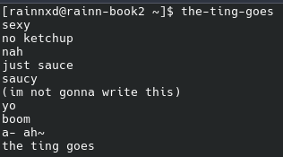

# the-ting-goes
A simple joke Bash Script

# Screenshots



# Flags

-p --panic / A flag that makes so when the loop ends your gifted with kernel panic

# Installation
```bash
sudo curl -sSL https://raw.githubusercontent.com/batata123muitoboa-dot/uptime-roast/main/uptime-roast -o /usr/bin/uptime-roast && sudo chmod +x /usr/bin/uptime-roast
